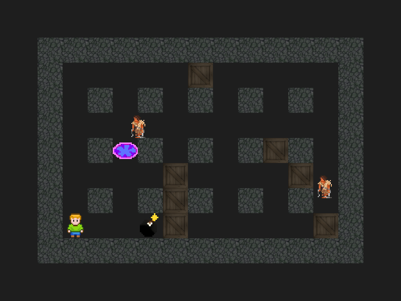

# Feladat (Rövid)
Az eredeti bomberman játék alapkoncepcióját utánzó programról van szó.
A játékos a pályán tud mozogni, robbanó tölteteket lerakni, ellenségek erőket vagy falakat robbantani ezáltal.

A játékot lehetőség van bármikor lementeni és visszatölteni, vagy akár újat generálni.

A játékot parancssorból lehet elindítani, onnatól a játékmenet lényegi része grafikus.

# Feladat
- Paraméterek
	> Ahol nem specifikált paraméterek vannak ott a játék élvezhetőségének legoptimálisabb értékeket kell megtalálni. Ilyen például a négyzetméret, ami a játék minden objektumára, karakterére értendő méret
- Indítás
	> A játék indítása után egy páratlanszor páratlan dimenziójú pályára kerülünk.
- Megjelenítés
	> A játék természetesen grafikus. A képernyő közepén mindig a játékos legyen, amíg él.
- Pálya (objektumok)
	> A pálya széleit elpusztíthatatlan objektumok veszik körül (benne van a méretben). A pálya belsejét nézve, ha azt négyzetekre osztva elképzeljük, akkor minden páros számú pozíción ((1,1) -től indítva a számozást) szintén egy elpuszíthatatlan objektum található. Ezen kívül x arányában véletlenszerűen találhatóak elpusztítható blokkok. Az objektumok átjárhatatlanok. Ez alól kivétel a játékos saját bombája, akkor ha annak lerakása után még nem ment ki alóla, illetve a tűz (halál). 2 karakter átmehet egymáson ha az egyik játékos a másik meg ellenség (halál).
- Játékos (karakter)
	> Indítás után egy nem foglalt, négyzet mezőre kerül a pályán belül. Mozogni a w,a,s,d billentyűkkel tud (fel, balra, le, jobbra). Szintén képes a space billentyűvel bombákat lehelyezni az alatta legközelebb lévő négyzet egységre. Egyszerre csak egy bomba lehet a pályán. A bomba x időn belül felrobban, majd egy 3x3-as + jelben tüzet hagy maga után y ideig. Ha a tűz érint egy elpuszíthatatlan blokkot, vagy karaktert, akkor az elpusztul.
- Ellenségek (karakterek)
	> A pályában x mennyiségű ellenség van kezdetben, akik mozognak egy irányba. Véletlenszerűen, de nem túl gyakran váltanak irányt. Az irányok lehetnek: jobbra, balra, fel, le. Ezek közül csak az egyik érvényesül és sebességük megegyező méretű mindig.
- Cél
	> Cél a kijárat megtalálása, ami az egyik elpusztítható objektum alatt lesz. Ebbe akkor lehet belemenni és megnyerni a játékot, ha már minden ellenség meghalt. A játék végét egy sárga képernyő jelzi. Ha a karaktert tűz vagy ellenség éri, akkor a játék végét egy piros képernyő jelzi.
- Kilépés
	> A játékból az ablakot bezárva lehet kilépni.
- Kinézet
	> Az egyes objektum típusok kinézetét külön képekből töltse be a program, melyek a program mellett legyenek egy mappában. Bár az objektumok méreteti előre meg lettek adva, azonban ezek csak az ütközés feltételei, a képek lehetnek akármekkora arányban átlátszóak. Egyéb megkötés nincs a kinézetre, ezt nem feladat megtervezni (de lehet).

# Használat (Linux parancsok)
- Indítás
	- Új pálya: `./main`
	- world.save betöltése: `./main load` (más spawn point)
- Játék irányítás
	- Mozgás
		- `W`/Fel
		- `A`/Balra
		- `S`/Le
		- `D`/Jobbra
	- Bomba lehelyezés: `Space`
	- Pálya mentése world.save-be: `Q`
	- Kilépés: `Egér kattintás`
- Játék
	- Cél
		> A pályán találhatóak ellenséges erők, melyekkel az érintkezés halálos. Azonban nem elég kikerülni őket! Meg kell találni az összeset és bomba lehelyezésével meg kell semmisítened mindet. Ezzel párhuzamosan kereshető a kijárat, amely az egyik elpusztítható doboz alá van elrejtve, azonban ezt csak akkor használhatod, ha mindegyik ellenséggel legyőzted.
	- Szabályok
		- Bomba nem azonnal robban.
		- A bomba okozta tűz se azonnal tűnik el.
		- Egyszerre 1 bombát lehet lehelyezni.
		- Vannak elpusztíthatatlan blokkok, amely a játék stílus sajátosságát adják.
	- Tippek
		- Kezdéskor is szembe találhatod magad ellenséges erőkkel.
		- Mindenkinek a hitboxa egy négyzet, erre ügyelj!
		- Vigyázz hogy a bomba okozta tűz nehogy téged is a martalékává tegyen!
		- Az irányítás is a játék nehézsége (😉), érdemes két billentyűt egyszerre használni

# Fordítás
- SDL2 könyvtárat igényli: [Link](https://infoc.eet.bme.hu/sdl_telepito/)

# Felépítés
- type
	> Itt található minden típushoz kötődő dolog.  
	  > A célja, hogy az objektumok létrehozása és felszabadítása ne ismétlődjön, azok alapértelmezett értékei egységesek legyenek.  
	  > Előnye az, hogy hibákat is ki lehet iktatni, ha csak egy helyen kell helyesen megírni a dolgokat.  
- resource
	> Itt találhatóak a betöltendő képek a típusnak megfelelő mappában 0-tól kezdődő indexeléssel, png formátumban.  
	> Bár nem volt feladat az animáció, de ez kihagyható ha nem adunk meg csak 0.png nevű képeket.  
- main
	> Ez tartalmazza a modulok indításának vezérlését.  
- client
	> Ez az egység felelős a megjelenítésért, illetve a bemenetek kezeléséért.  
- server
	> Ez az egység felelős a pálya létrehozásáért/betöltéséért, illetve annak következő állapotának kiszámításáért.  
	> Szintén tartalmaz autentikációt, egy client ellenére, hogy felületesen imitálja a server client modellt.  
- SDL
	> Itt találhatóak az SDL-hez kötődő dolgok: inicializálás, textúrák cachelése, ...  
- geometry
	> Ide minden a pályához, annak szerkezetéhez kapcsolodó függvények tartoznak pl.: ütközés  
- config
	> A nevéből is adódóan itt a játék működését lehet szabályozni.  
- network
	> Bár nincs valódi hálózat a játékban, de későbbi fejlesztést megkönnyíti egy absztrakt modul. Itt lényegében a client és a server modul közötti konverzió történik.  

# Adatszerkezetek
- List
	> Olyan helyeken szerepel, ahol a mérete sokszor változik, akár mindkét irányba.
- Array
	> Olyan helyeken szerepel, ahol a méret sokszor változik, de csak növekedhet.

# Függvény leírás
> Nincs mindenhol említve, hogy fel kell szabadítani a memóriát, mivel a visszaadtott adatszerkezetből egyértelmű ez.
- type
	- \*
		```c
		//TypeNew creates a new Type
		Type* TypeNew()

		//TypeDelete frees Type
		void TypeDelete(Type* type)
		```
	- list
		```c
		//ListInsert inserts data into List by reference
		ListItem* ListInsert(List** list, void* data)

		//ListInsertItem appends ListItem to List by reference
		void ListInsertItem(List** list, ListItem* listItem)

		//ListRemoveItem removed ListItem referenced from list
		//dataFree is called on ListItem->data if it is not NULL
		void ListRemoveItem(List** list, ListItem* listItem, void (*dataFree)(void*))

		//ListFindItemByFunction returns first ListItem where func(ListItem->data) holds
		ListItem* ListFindItemByFunction(List* list, bool (*func)(void*))

		//listFindItemByPointerFunction is a helper function of ListFindItemByPointer
		bool listFindItemByPointerFunction(void* data)

		//ListFindItemByPointer returns first ListItem where ListItem->data == data
		//can not be run in parallel
		ListItem* ListFindItemByPointer(List* list, void* data)

		//ListNew creates a new List
		List* ListNew()

		//ListDelete frees all ListItem
		//dataFree is called on ListItem->data if it is not NULL
		void ListDelete(List* list, void (*dataFree)())
		```
	- array
		```c
		//ArrayNew creates a new Array
		Array* ArrayNew(size_t size)

		//ArrayInsert insert element into the last position of Array
		void ArrayInsert(Array* array, void* value, size_t size)

		//ArrayDelete frees Array
		void ArrayDelete(Array* array, void(*dataFree)(void*))
		```
	- geometry
		```c
		//PositionSame determines if a and b have the same coordinate
		bool PositionSame(Position a, Position b)
		```
- client
	```c
	//Tick draws new frame
	static Uint32 Tick(Uint32 interval, void *param)

	//EventKey handles movement key events
	static int EventKey(void* data, SDL_Event* sdl_event)

	//ClientConnect connects to a server
	void ClientConnect(void)

	//DrawCharacterFind find CharacterYou
	static Character* DrawCharacterFind(WorldClient* worldClient)

	//DrawCharacter draws gameend screen
	static void DrawGameend(WorldClient* worldClient)

	//DrawCharacter draws exit
	static void DrawExit(WorldClient* worldClient, Position offset)

	//DrawCharacter draws objects
	static void DrawObject(WorldClient* worldClient, Position offset)

	//DrawCharacter draws characters
	static void DrawCharacter(WorldClient* worldClient, Position offset)

	//Draw draws to SDLRenderer
	static void Draw(WorldClient* worldClient)

	//ClientReceive gets updates from server
	//worldCopy is not used after return
	void ClientReceive(WorldClient* worldCopy)

	//ClientStop loads client module
	void ClientStart(void)

	//ClientStop unloads client module
	void ClientStop(void)
	```
- server
	```c	
	//WorldGenerate generates default map
	static void WorldGenerate(int height, int width)

	//CharacterFindFunction is a helper function of CharacterFind
	static bool CharacterFindFunction(void* data)

	//CharacterFind returns Character for UserServer
	//can not be used in parallel
	static Character* CharacterFind(UserServer* userServer)

	//AuthFind returns UserServer with that auth or NULL if does not exists
	static UserServer* AuthFind(char* auth)

	//AuthCreate creates a 26 character long auth key
	static char* AuthCreate()

	//TickCalculateDestroyBomb removes bomb and creates fire in its place
	//if object->type != ObjectTypeBomb then nothing happens
	static void TickCalculateDestroyBomb(Object* object)

	//TickCalculateFireDestroy makes fires destroys all ObjectTypeBox and all Character in collision
	static void TickCalculateFireDestroy()

	//TickCalculateEnemyKillCollisionDetect is a helper function of TickCalculateEnemyKill
	static bool TickCalculateEnemyKillCollisionDetect(void* this, Character* that)

	//TickCalculateWin checks if any CharacterTypeUser if in a winning state and removes them if so
	static void TickCalculateWin()

	//TickCalculateEnemyKill checks if any CharacterTypeUser is colliding with CharacterTypeEnemy and kills them if so
	static void TickCalculateEnemyKill()

	//TickCalculateEnemyMovement randomly creates a new random direction for CharacterTypeEnemys
	static void TickCalculateEnemyMovement()

	//TickCalculateDestroy removes items where .destroy == tickCount
	//destroy hooks also added here
	static void TickCalculateDestroy()

	//TickCalculateAnimate calculates next texture state from current
	static void TickCalculateAnimate()

	//TickCalculate calculates next state from current
	static void TickCalculate()

	//TickSend sends new world to connected clients
	static void TickSend()

	//Tick calculates new frame, notifies users
	Uint32 Tick(Uint32 interval, void *param)

	//Save saves worldServer and tickCount into world.save
	void Save()

	//Load loads world.save into worldServer
	void Load()

	//EventKey handles WorldServer saving
	static int EventKey(void* data, SDL_Event* sdl_event)

	//ServerStart generates world, start accepting connections, starts ticking
	void ServerStart(bool load)

	//ServerReceive gets updates from users
	//userServerUnsafe is not used after return
	void ServerReceive(UserServer* userServerUnsafe)

	//ServerStop clears server module
	void ServerStop(void)

	//ServerConnect register new connection user, returns it with auth
	//userServerUnsafe is not used after return
	void ServerConnect(UserServer* userServerUnsafe)
	```
- network
	```c
	//NetworkServerStop disables incoming requests
	void NetworkServerStop(void)

	//NetworkServerStart enables incoming requests
	void NetworkServerStart(void)

	//NetworkClientStop disables incoming requests
	void NetworkClientStop(void)

	//NetworkClientStart enables incoming requests
	void NetworkClientStart(void)

	//NetworkSendClient send worldServer to client as WorldClient
	void NetworkSendClient(WorldServer* worldServer, UserServer* userServer)

	//NetworkSendServer send userClient to server as UserServer
	void NetworkSendServer(UserClient* userClient)

	//NetworkConnectServer client request to server to create connection
	void NetworkConnectServer(UserClient* userClient)
	```
- geometry
	```c
	//Collision tells whether there's a collision between objects at positions
	bool Collision(Position position1, Position position2)

	//CollisionObjectSGet returns a List with Objects colliding with this
	//collisionDecideObjectFunction decides for each object whether it should be taking into account
	//if collisionDecideObjectFunction is NULL then it's treated as always true
	List* CollisionObjectSGet(List* objectS, Position position, void* this, Collision
		
	//CollisionCharacterSGet returns a List with Characters colliding with this
	//collisionDecideCharacterFunction decides for each object whether it should be taking into account
	//if collisionDecideCharacterFunction is NULL then it's treated as always true
	List* CollisionCharacterSGet(List* characterS, Position position, void* this, CollisionDecideCharacterFunction collisionDecideCharacterFunction)

	//CollisionLinePositionGet calculates position taking collision into account in discrete line (from, to)
	//from must not be equal to to
	//we can be NULL
	//if collisionDecideObjectFunction is NULL then it's treated as always true
	//if collisionDecideCharacterFunction is NULL then it's treated as always true
	Position CollisionLinePositionGet(
	WorldServer* worldServer,
		Position from,
		Position to,
		void* we,
		CollisionDecideObjectFunction collisionDecideObjectFunction,
		CollisionDecideCharacterFunction collisionDecideCharacterFunction
	)

	//CollisionFreeCountObjectGetRecursion is a helper function of CollisionFreeCountObjectGet
	static int CollisionFreeCountObjectGetRecursion(WorldServer* worldServer, Position positionCompress)

	//CollisionFreeCountObjectGet returns how many square sized object-free area is reachable from (position - position % squaresize)
	int CollisionFreeCountObjectGet(WorldServer* worldServer, Position position)

	//SpawnGet return a position where there's at least 3 free space reachable without action so player does not die instantly
	Position SpawnGet(WorldServer* worldServer, int collisionFreeCountObjectMin)
	```
- key
	```c
	//KeyMovementCollisionDetectObject is a helper function of KeyMovement
	static bool KeyMovementCollisionDetectObject(void* this, Object* that)

	//KeyMovementCollisionDetectCharacter is a helper function of KeyMovement
	static bool KeyMovementCollisionDetectCharacter(void* this, Character* that)

	//KeyMovement moves character based on it's pressed keys
	void KeyMovement(Character* character, WorldServer* worldServer)

	//KeyBombPlace places a bomb to the nearest square in the grid relative to the character
	void KeyBombPlace(Character* character, WorldServer* worldServer, long long tickCount)

	//KeyMovementRandom sets randomly one key to be active
	void KeyMovementRandom(Character* character)
	```
- SDL
	```c
	//SDLResourceListLoadObject loads resources related to objects into TextureSSObject
	static void SDLResourceListLoadObject(void)

	//SDLResourceListLoadCharacter loads resources related to characters TextureSSCharacter
	static void SDLResourceListLoadCharacter(void)

	//SDLInit loads SDL modules
	void SDLInit(void)

	//SDLTextureDelete is a helper function of SDLTextureDelete
	static void SDLTextureDelete(void* texture)

	//SDLDestroy unloads SDL modules
	void SDLDestroy(void)
	```

# Credit
- [Character](https://opengameart.org/content/animated-character)
- [Box](https://opengameart.org/content/2d-wooden-box)
- [Wall](https://opengameart.org/content/handpainted-stone-floor-texture)
- [Enemy](https://opengameart.org/content/enemy-slave)
- [Bomb](https://opengameart.org/content/16-bit-animated-bomb)
- [BombFire](https://opengameart.org/content/fireflame)
- [Exit](https://opengameart.org/users/rrcaseyr)
